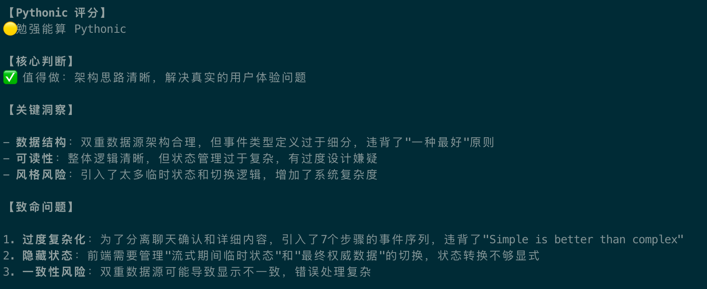

# 把「Python 之禅」放到 Claude Code 中

## 使用方法

将 [`CLAUDE.md`](CLAUDE.md) 文件复制到你的项目中。

## 使用示例

## 致谢

参考了 kingkongshot 的 CLAUDE.md，并在此基础上进行了修改，原 Prompt 链接：https://github.com/kingkongshot/prompts/tree/main/prompts/claude